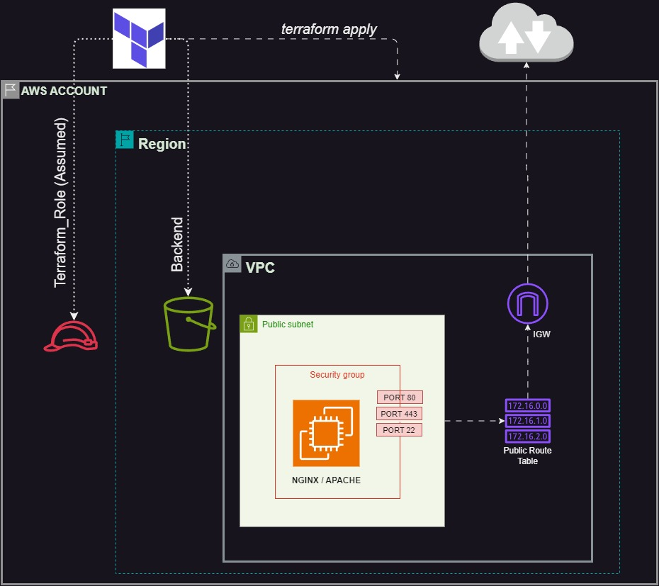

# Deploying a publicly Accessible ec2 instance in AWS through IAC (Terraform)

In this project, we will deploy an EC2 instance on AWS. We will set up a new VPC, configure public and private subnets, and launch an EC2 instance using the Ubuntu AMI. Ensure to utilize Terraform for creating as many resources as possible, and remember to delete all resources at the end of the project to prevent unnecessary costs.
)

# What my Tree Structure Looks Like
```
|-- backend.tf
|-- ec2_instances.tf
|-- main.tf
|-- modules
| |-- ec2_instance
| | |-- data.tf
| | |-- main.tf
| | |-- outputs.tf
| | |-- variables.tf
| |-- vpc_resources
| | |-- main.tf
| | |-- outputs.tf
| | |-- variables.tf
|-- outputs.tf
|-- provider.tf
|-- terraform.tfvars
|-- variables.tf
```
# Desired Outcome

1. Deploy a new VPC in your preferred AWS region.

2. Create a public subnet within the VPC.Ensure the public subnet is linked to a custom route table with a route to an Internet Gateway.

3. Set up a security group that permits traffic only on ports 80 (HTTP), 443 (HTTPS), and 22 (SSH) from your IP or publicly if you are aware of the implications.

4. Launch an EC2 instance in the public subnet using the Ubuntu AMI (Tip: Utilize data sources).

5. Attach the instance to the created security group and verify that you can access the server via SSH using its public IP.

6. Tag resources with relevant information about your project.

7. Ensure all resources are deleted at the end of the project to avoid unnecessary costs!

# Steps To Reproduce on your local
## Prerequisites
- Terraform v1.00 or later
- AWS CLI configured with appropriate credentials
- An S3 bucket and DynamoDB table for Terraform state management
## Getting Started
- Clone the Repository and cd into it
```
git clone https://github.com/godfreyfm/Terraform-Publicly_Available_Instance.git
```
## Configure Terraform
Update the terraform.tfvars file with your AWS details and other necessary variables.

```
### Variables needed for provider connection /////////////////////////////////////////////////
profile  = "**************"
role_arn = "********************"
region   = "********************"


### VPC Block and Subnet specific Variables /////////////////////////////////////////////////
map_public_ip_on_launch = true # Enables instances created in this region to have public IP address
vpc_cidr                = "10.0.0.0/16"
subnet_cidr             = "10.0.0.0/24"
subnet_availabilty_zone = "*************"

###  Variables needed for tagging. Feel free to use variables that make sense for your use case /////////////////////////////////////////////////
global_tags = {
  "Env"         = "*****"
  "portfolio"   = "*******"
  "Cost_Center" = "*****"
}
vpc_name                = "*****"
subnet_name             = "*****"
igw_name                = "******"
route_table_name        = "*******"
aws_security_group_name = "*******"
instance_name           = "*******"

### Connectivity variables ///////////////////////////////////////////////// 
pub_address = "0.0.0.0/0"

### EC2 Specific Variables ///////////////////////////////////////////////// 
instance_type = "t2.micro"
key_name      = "*************" 

```
## Initialize Terraform
Initialize the Terraform configuration to download the necessary providers and modules.
```
terraform init
```
## Plan the Deployment
Generate and review the execution plan.
```
terraform plan
```
## Apply the Configuration
Apply the Terraform configuration to deploy the infrastructure.
```
terraform apply
```
#### Comment your thoughts on the subject

- Comments on the subject are welcome !!!
